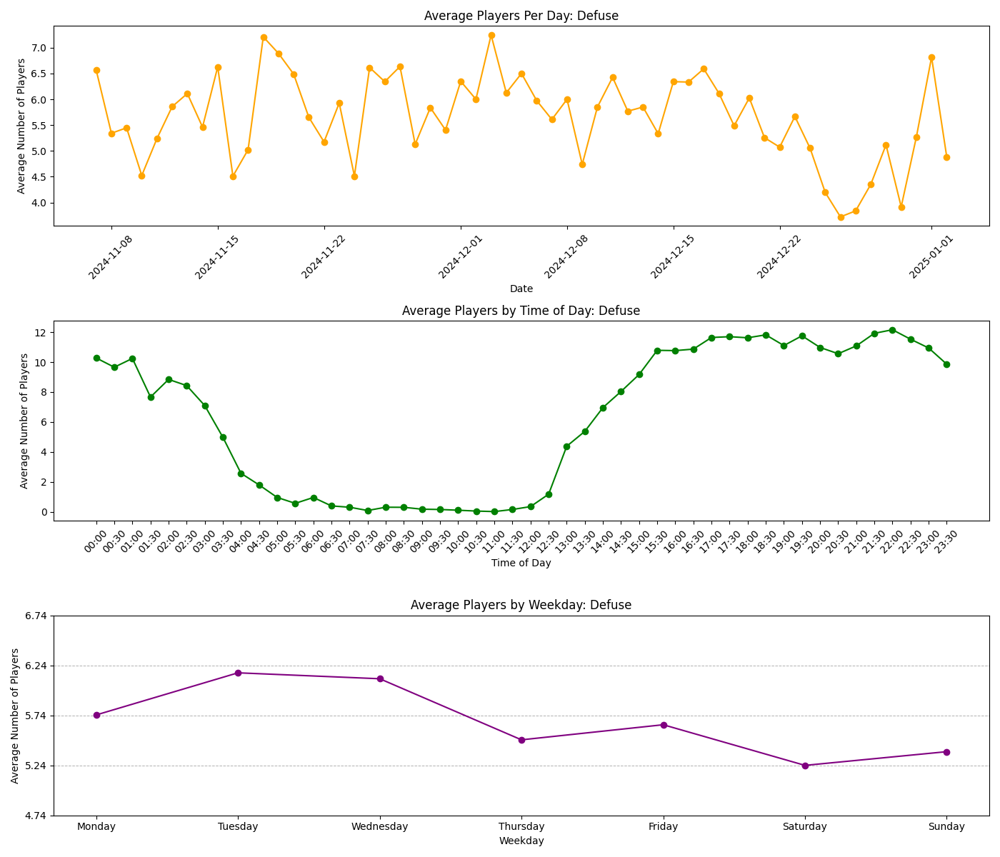
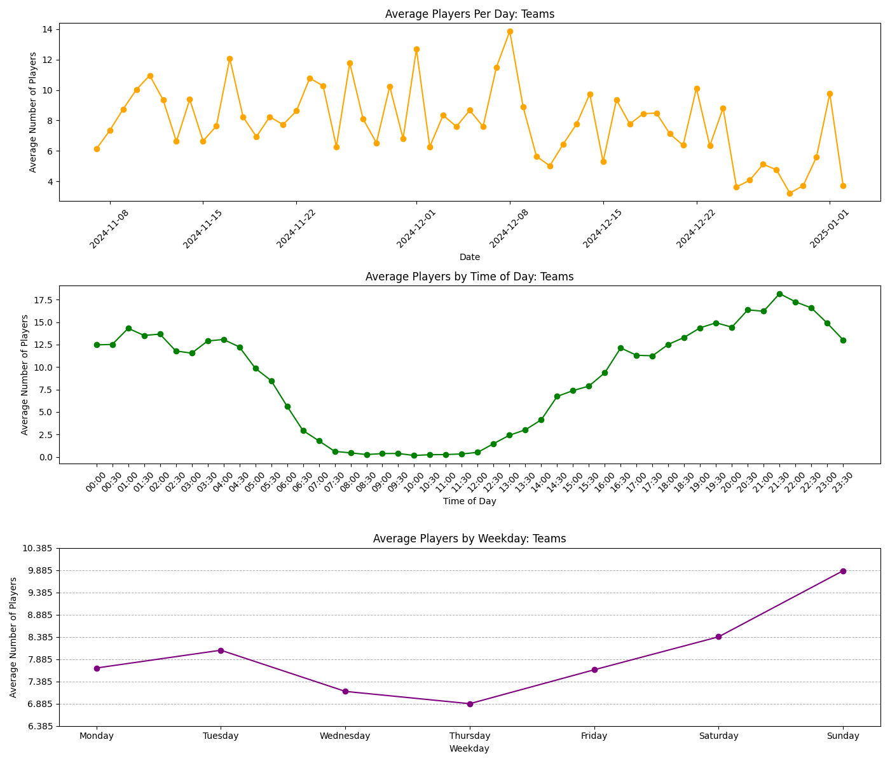

# Defly server checker
This script uses a CRON job to check the defly.io teams and defuse server in the USE region every 30 minutes. The raw data for this (updated every few weeks), can be found here:

## Installation
Clone the repository:
```sh
git clone https://github.com/zisra/check-defly-servers
cd defly-server-checker
```
Install the requirements:
```sh
pip install -r requirements.txt
npm install
```

## Usage
To collect the data every 30 minutes:
```sh
npm start
```
To plot the data:
```sh
npm run graph:teams
npm run graph:defuse
```

## Data
- [defuse.csv](./data/defuse.csv)
- [teams.csv](./data/teams.csv)

## Images
<div style="display: flex; justify-content: space-between;">
     
    
</div>